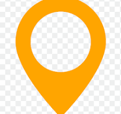

<!-- THIS CODE IS ON KASHINAT.UNNE.143@GMAIL.COM  file as on chatgpt is HTML CSS Layout Design-->

<!DOCTYPE html>
<html lang="en">
<head>
  <meta charset="UTF-8">
  <meta name="viewport" content="width=device-width, initial-scale=1.0">
  <title>Travel Destination</title>
  
</head>
<body>
  <!-- Navbar -->
  

    

      
      <h2>Travlog</h2>
    

    <ul>
      <li>Home</li>
      <li>Destinations</li>
      <li>About Us</li>
      <li>Contact</li>
    </ul>
    

      <button class="btn login">Login</button>
      <button class="btn signup">Signup</button>
    

  

  <!-- Main Content -->
  

    

    <!-- Text Section -->
    

      

        Explore the world!🎁
      

      <h1>
        Travel top destination  of the world
      </h1>
      
We always make our customer happy by providing as many choices as possible

      

        <button class="btn get-started">Get Started</button>
        <button class="btn watch-demo">Watch Demo</button>
      

    

    <!-- Image Section -->
    

      <!-- Left Images -->
      

        

          
          

            
          

        

        
        

          
        

      

      <!-- Right Image -->
      

        

          
          

            Top Places
          

        

      

    

  

<!-- ==========================2nd HTML=================================-->

  

    <!-- Left Section: Original Orange Triangles -->
    

      

      

      

      

      

      

    

    <!-- Left Section: Additional Front Triangles -->
    

      

      

      

      

      

      

    

    <!-- Main Section: Logos -->
    

      
      
      
      
      
    

    <!-- Right Section: Contact Logo -->
    

      

        
      

    

  

<!-- ==========================3rd HTML=================================-->

  <section class="services">
    <!-- Text Section -->
    

        <h5>SERVICES</h5>
        <h1>Our top value  categories for you</h1>
    

    
    <!-- Cards Section -->
    

        <!-- Card 1 -->
        

            

                
            

            

                <h3>Best Tour Guide</h3>
                
What looked like a small  patch of purple grass,  above five feet.

            

        

        <!-- Card 2 -->
        

            

                
            

            

                <h3>Easy Booking</h3>
                
Square, was moving   across the sand in their   direction.

            

        

    

</section>

<!-- ==========================4th HTML=================================-->

  
Top Destination

  <h1 class="subtitle">Explore top destination</h1>

  

      <!-- Card 1 -->
      

          
          

              
Paradise Beach,  Bantayan Island

              
$550.16

          

          

              
Rome, Italy

              

                   &#9733;  4.8⭐ 
              

          

      

      <!-- Card 2 -->
      

          
          

              
Ocean with full of  Colors

              
$20.99

          

          

              
Maldives

              

                   &#9733; 4.5⭐
              

          

      

      <!-- Card 3 -->
      

          
          

              
Mountain View,  Above the cloud

              
$150.99

          

          

              
United Arab Emirates

              

                    &#9733; 5.0⭐ 
              

          

      

  

  

      
&#8592;

      
&#8594;

  

  

      

          &#10006;
      

      

          &#10006;
          &#10006;
      

      

          &#10006;
          &#10006;
          &#10006;
      

  

<!-- ==========================5th HTML=================================-->

  <!-- Gradient Circles -->
  

  

  

  

  

  <!-- Background Design -->
  

  <!-- Left Section -->
  

    

      
      

         Discounted Price
      

    

  

  <!-- Right Section -->
  

    <h1 class="travel-point">Travel Point</h1>
    <h2 class="travel-heading">We helping you find your dream location</h2>
    

      Contrary to popular belief, Lorem Ipsum is not simply random text. It has roots in a piece of classical Latin literature from 45 BC.
    

    

      

        <strong>500+</strong> Holiday Package
      

      

        <strong>100</strong> 
        Luxury Hotel
        
          
        
      

      

        <strong>7</strong> Premium Airlines
      

      

        <strong>2k+</strong> Happy Customer
      

    

  

<!-- ==========================6th HTML=================================-->

  <!-- Left Section -->
  

    
Key Features

    <h1>We offer the best services</h1>
    

      Contrary to popular belief, Lorem Ipsum is not simply random text. It has
      roots in a piece of classical Latin literature from 45 BC.
    

    <!-- Feature List -->
    

      

        

          
        

        

          <h3>We offer best services</h3>
          
Lorem Ipsum is not simply random text

        

      

      

        

          
        

        

          <h3>Schedule your trip</h3>
          
It has roots in a piece of classical

        

      

      

        

          
        

        

          <h3>Get discounted coupons</h3>
          
Lorem Ipsum is not simply random text

        

      

    

  

  <!-- Right Section -->
  

    

      
      <!-- Decorative Text with Icon -->
      

        
        Paradise on Earth
      

      <!-- Decorative Patterns -->
      

          

            X
            X
            X
            X
            X
            X
            X
            X
            X
            X
            X
            X
            X
            X
            X
            X
            X
            X
            X
            X
            X
            X
            X
            X
            X
            X
            X
            X
            X
            X
            X
            X
            X
            X
            X
            X
            X
            X
            X
            X
            X
            X
            X
            X
            X
            X
            X
            X
            X
            X
            X
            X
            X
            X
            X
            X
            X
            X
            X
            X
            X
            X
            X
            X
            X
            X
            X
            X
            X
            X
            X
            X
            X
            X
            X
            X
            X
            X
            X
            X
            X
            X
            X
            X
            X
            X
            X
            X
            X
            X
            X
            X
            X
            X
            X
            X
            X
            X
            X
            X
            X
            X
            X
            X
            
 
      

      

        

        

        

        

        

        

        

        

        

        

        

        

        

        

        

        

        

        

        

        

        

        

        

        

      

    

    
  

<!-- ==========================7th HTML=================================-->

  <h2 class="testimonial-title">TESTIMONIALS</h2>
  <h3 class="testimonial-subtitle">Trust our clients</h3>

  

    <!-- Left Arrow -->
    <button class="nav-arrow left-arrow">&larr;</button>

    <!-- Testimonial Content -->
    

      

        
      

      <h4 class="client-name">Mark Smith / Travel Enthusiast</h4>
      

        ★★★★★
      

      

        Contrary to popular belief, Lorem Ipsum is not simply random text. It has roots in a piece of classical Latin literature from 45 BC.
      

    

    <!-- Right Arrow -->
    <button class="nav-arrow right-arrow">&rarr;</button>
  

  <!-- Pagination Dots -->
  

    
    
    
  

<!-- ==========================8th HTML=================================-->

  

  <h3 class="newsletter-title">SUBSCRIBE TO OUR NEWSLETTER</h3>
  <h1 class="main-heading">Prepare yourself & let’s explore the beauty of the world</h1>
  <form class="subscription-form">
    

       <!-- Replace with your email icon image -->
      <input type="email" placeholder="Your Email" required>
      <button type="submit">Subscribe</button>
    

  </form>
  

<!-- ==========================9th HTML=================================-->

<footer class="footer1">
  

    <!-- Left Section -->
    

      

         <!-- Replace with your Travlog logo image -->
        Travlog
      

      

        Contrary to popular belief,  Lorem Ipsum is not simply   random text. 
        It has roots   in a piece of classical Latin   literature from 45 BC.
      

    

    <!-- Middle Section -->
    

      

        <h4>Company</h4>
        <ul>
          <li><a href="#">About</a></li>
          <li><a href="#">Career</a></li>
          <li><a href="#">Mobile</a></li>
        </ul>
      

      

        <h4>Resources</h4>
        <ul>
          <li><a href="#">Why Travlog?</a></li>
          <li><a href="#">Partner with us</a></li>
          <li><a href="#">FAQs</a></li>
          <li><a href="#">Blog</a></li>
        </ul>
      

    

    <!-- Right Section -->
    

      <h4>Contact</h4>
      
+00 92 1234 56789

      
<a href="mailto:info@travlog.com">info@travlog.com</a>

      
205. R Street, New York

      
BD23200

    

  

  <!-- Social Media Icons -->
  

    
    
    
  

</footer>

</body>
</html>

